# Light

本节主要了解不同光照类型对环境的不同作用；

并在实际开发应用中对于不同的环境场景，选择合适该场景的灯光类型

## 环境光/AmbientLight

AmbientLight 会向在场景的所有几何形状、全向照明(它会均匀的照亮场景中的所有物体)

环境光不能用来投射阴影，因为它没有方向。
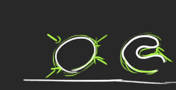

- 开启环境光
  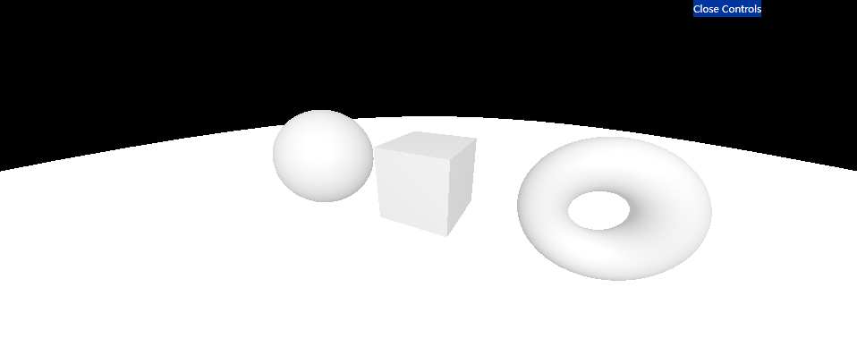
- 关闭环境光
  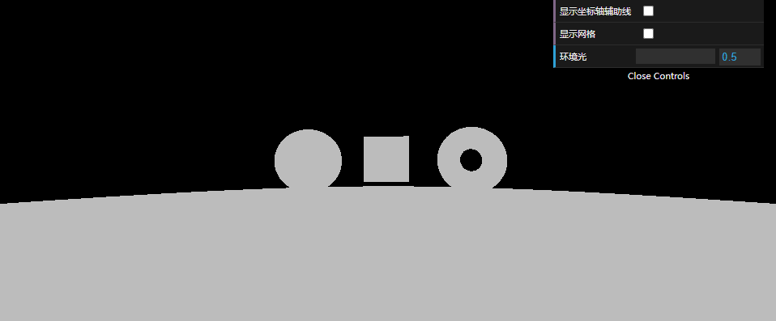

## 平行光/DirectionalLight

平行光是沿着特定方向发射的光。这种光的表现像是无限远，从它发出的光线都是平行的。
（通常用平行光来模拟太阳光的效果）所以它可以投射阴影

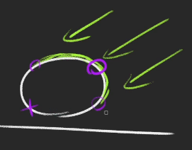

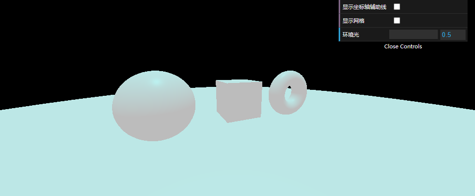

运用：
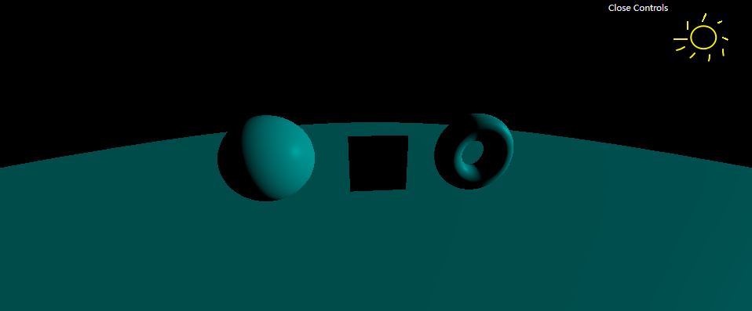

## 半球光/HemisphereLight

光源直接放置于场景之上，光照颜色随着光照距离由亮变暗，最终形成一个边缘线。

半球光不能投射阴影。
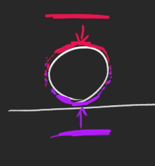

生活中的案例：地球晨昏线
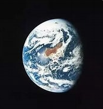

运用:
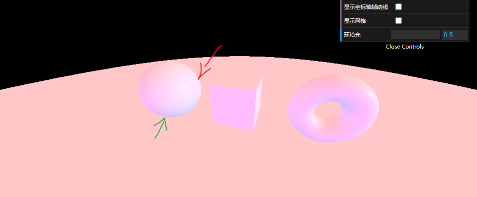

上红下蓝（边缘混合变紫）
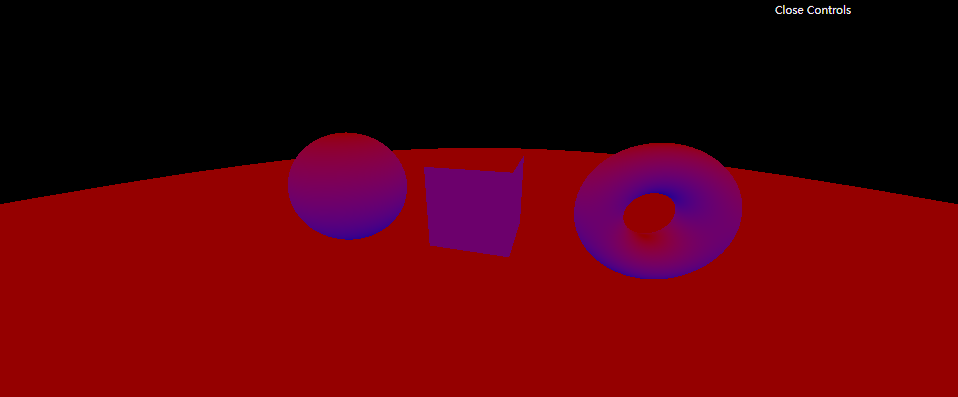

## 点光源/PointLight

从一个点向各个方向发射的光源。一个常见的例子是模拟一个灯泡发出的光。

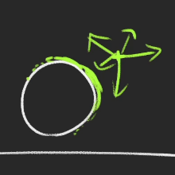

生活案例: 白炽灯
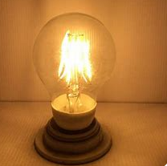

运用：
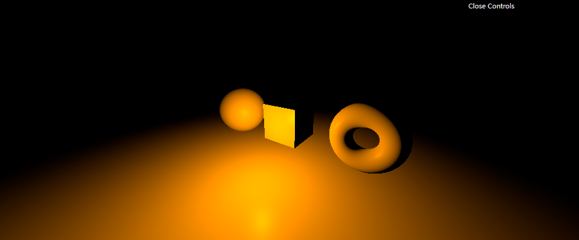

## 平面光光源/RectAreaLight

平面光光源从一个矩形平面上均匀地发射光线。这种光源可以用来模拟像明亮的窗户或者条状灯光光源。

不支持阴影。

生活案例：摄影打光灯
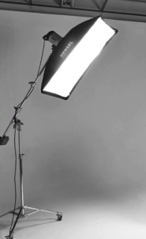

运用：
高级灰
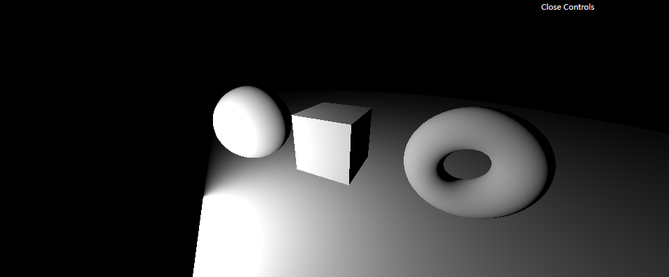

暗紫
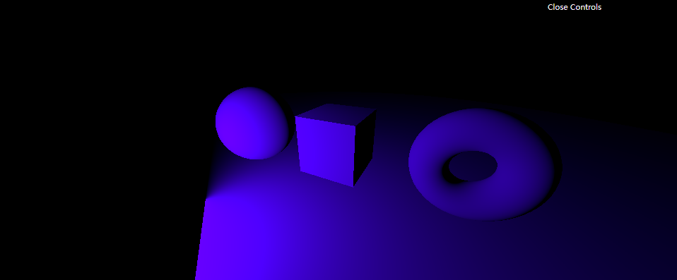

荧光绿
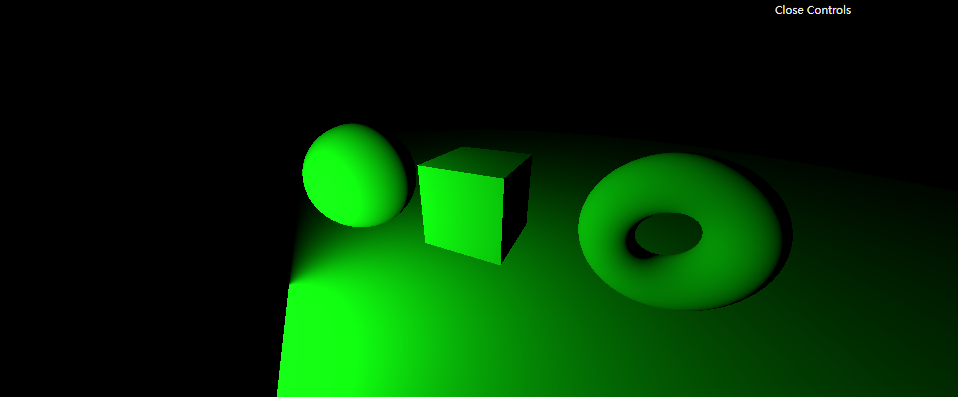

暖黄
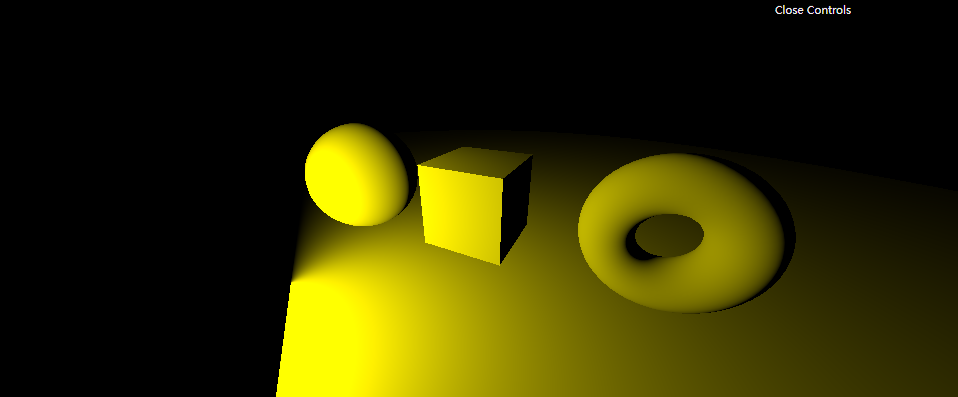

## 聚光灯/SpotLight

光线从一个点沿一个方向射出，随着光线照射的变远，光线圆锥体的尺寸也逐渐增大。
可以投射阴影
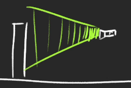

生活案例：手电筒
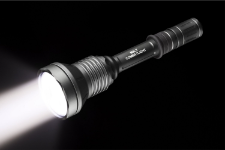

运用：
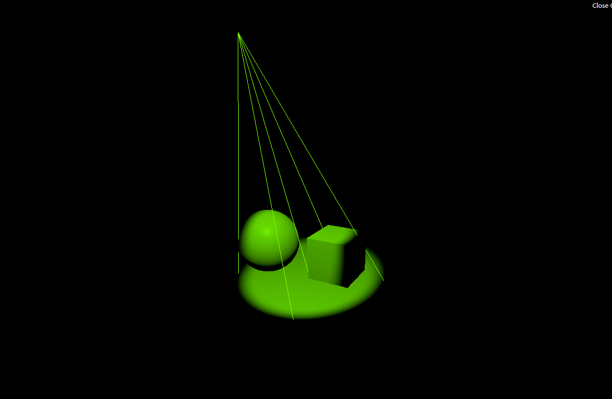
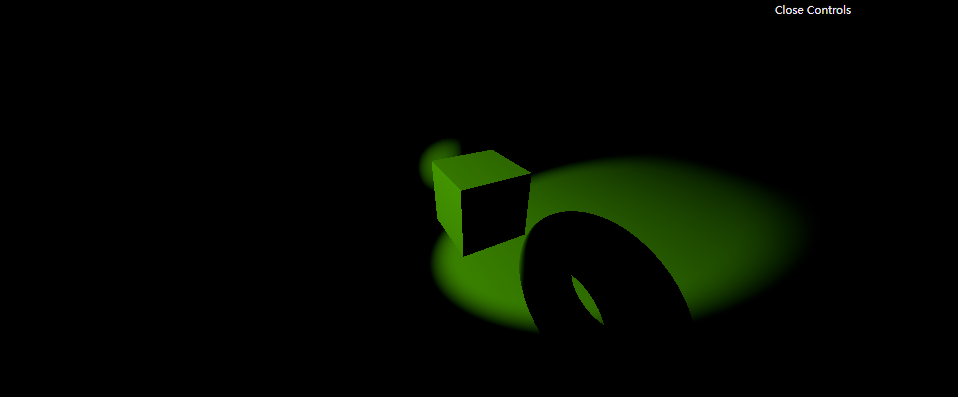

## Light
