# Material

本节主要了解不同材料，以及使用场景

# 材质类型

## 法线网格材质/MeshNormalMaterial

用于创建凹凸贴图的纹理
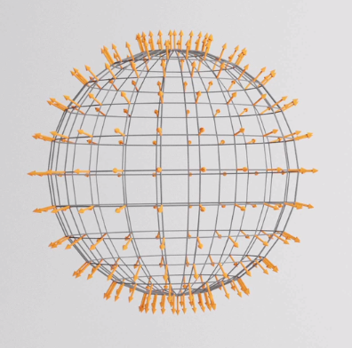

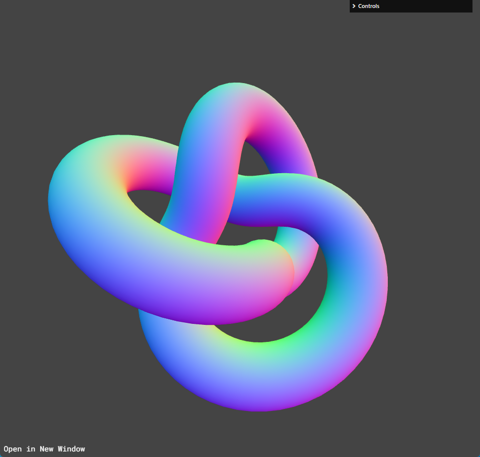
 

## 捕捉网格材质/MeshMatcapMaterial

捕捉(明暗、颜色纹理)网格材质

 

## 深度网格材质/MeshDepthMaterial

越靠近物体白色亮度越明显，反之越黑(近白远黑)
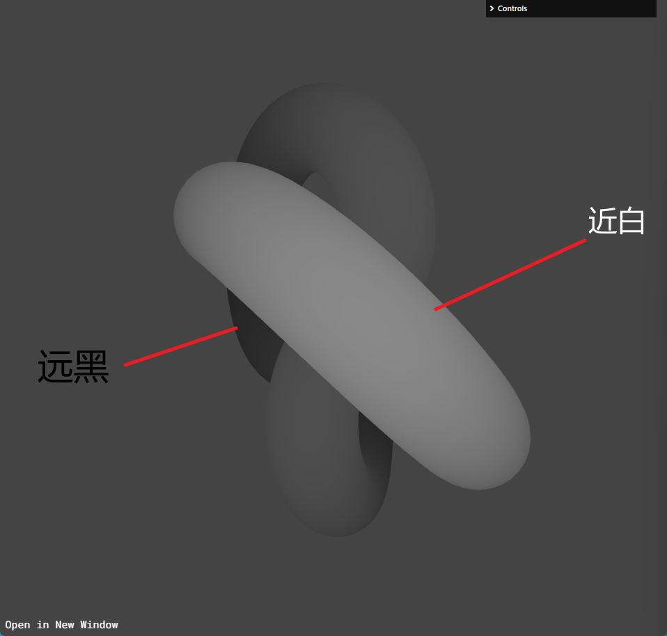

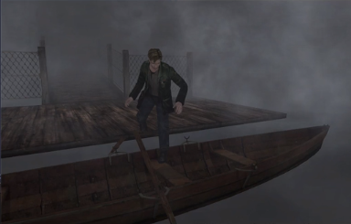

 

## Lambert 网格材质/MeshLambertMaterial

一种非光泽表面的材质，没有镜面高光。
该材质使用基于非物理的 Lambertian 模型来计算反射率。 这可以很好地模拟一些表面（例如未经处理的木材或石材），但不能模拟具有镜面高光的光泽表面（例如涂漆木材）
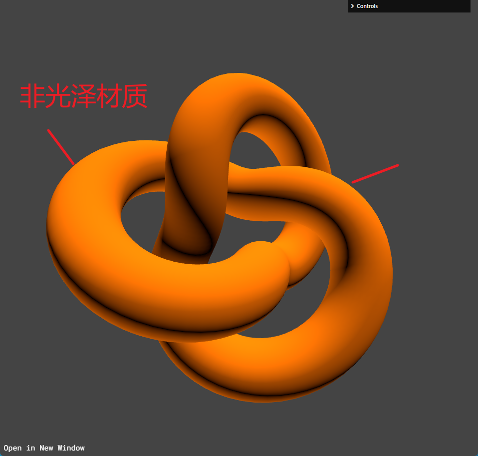

 

## Phong 网格材质/MeshPhongMaterial

一种用于具有镜面高光的光泽表面的材质。与 Lambert 材质相反
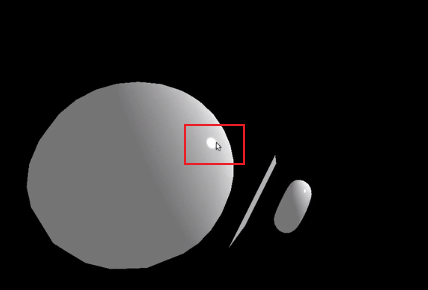
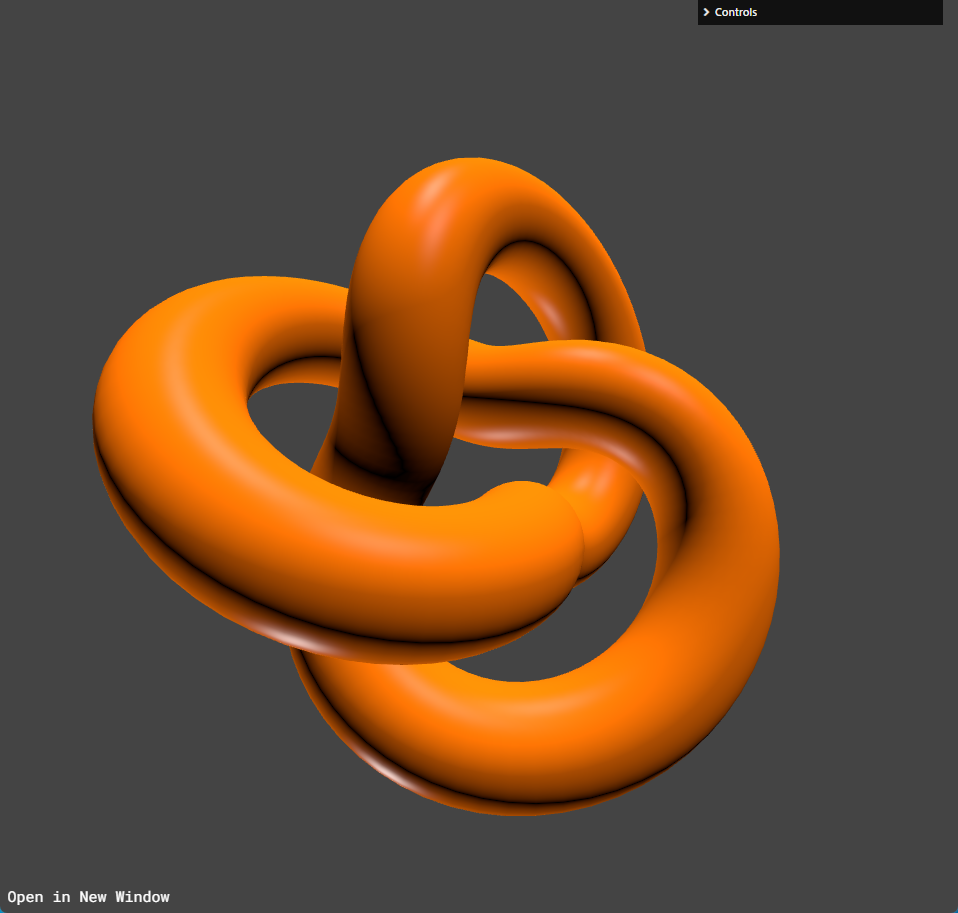
 

## 卡通网格材质/MeshToonMaterial

一种实现卡通着色的材质。该材质质感主要偏向柔和软萌，并且颜色饱和较高。

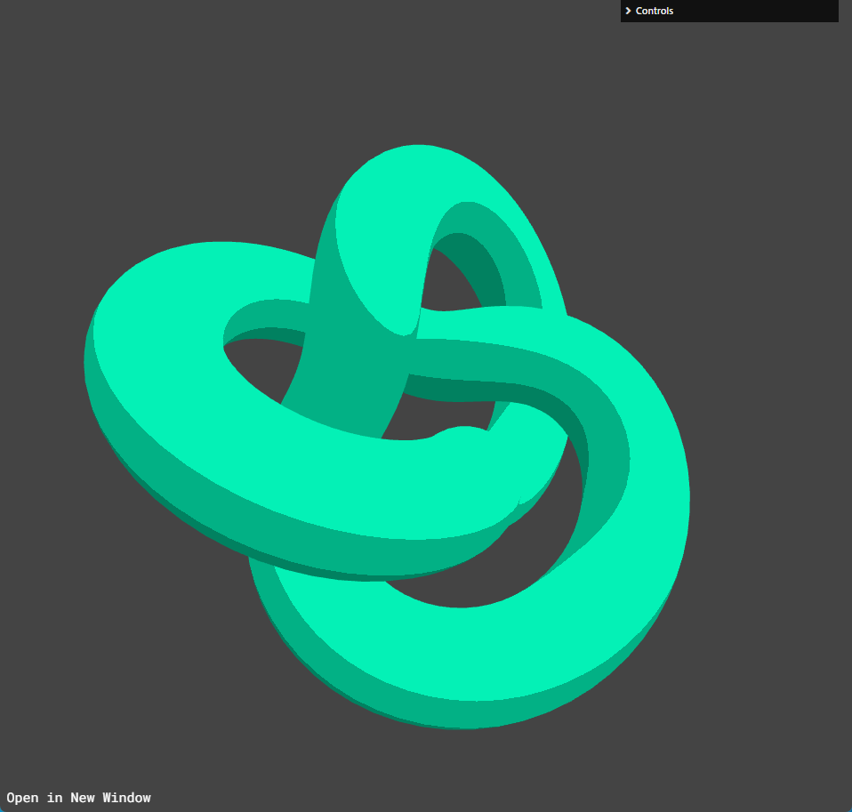

 

## 标准网格材质/MeshStandardMaterial

它与光泽材质 MeshPhongMaterial 类似，但是它无需借助环境光照（特定照明）来表现光泽。
它基于物理（PBR）渲染来创建一种材质，能够“正确”地应对所有光照场景。

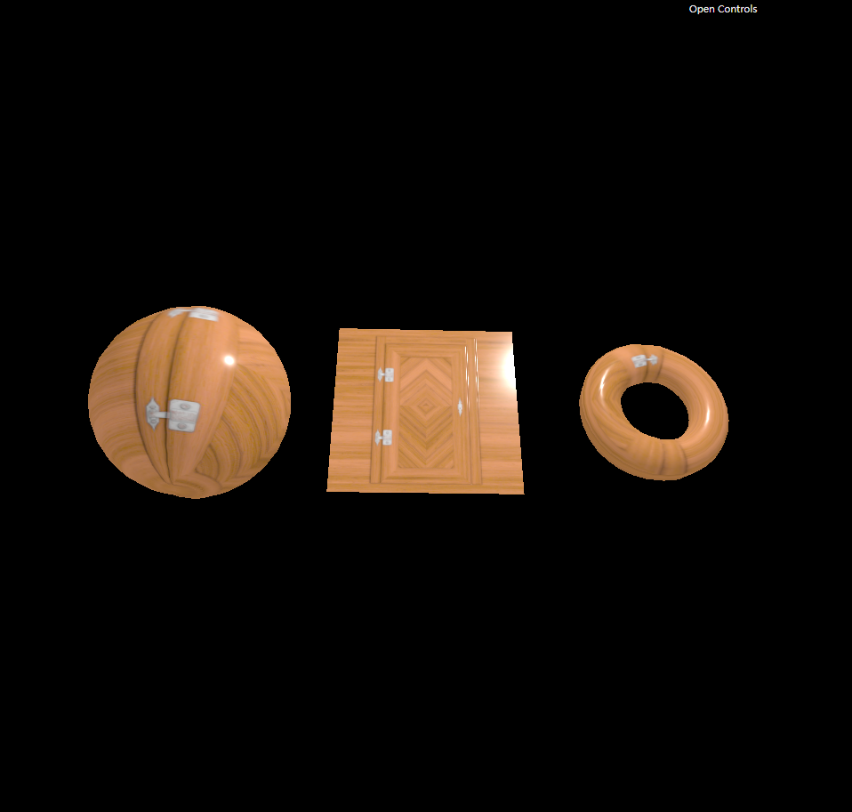

> 根据不同的材质，通过不同属性的细节调整

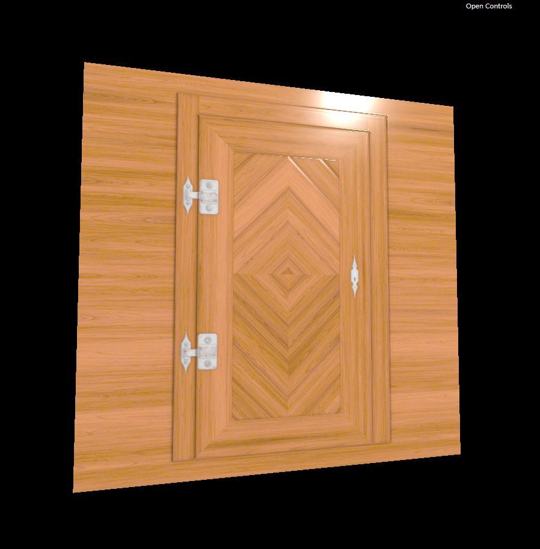

 

## 物理网格材质/MeshPhysicalMaterial

它是 MeshStandardMaterial 的扩展，提供了更高级的基于物理的渲染属性。

列如：车漆，碳纤，被水打湿的表面的材质需要在面上再增加一个透明效果等等

> 主要目的: 渲染更逼真的物理环境效果

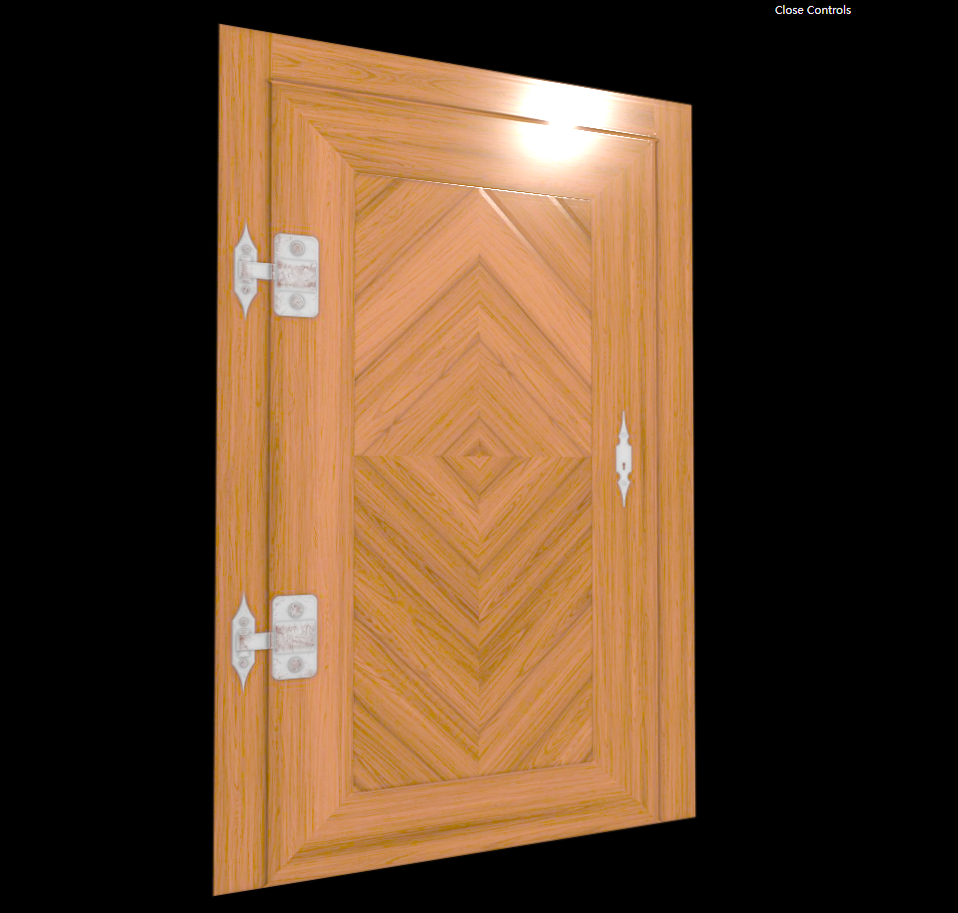

## 环境贴图材质（通过标准网格材质 envMap 属性设置）

将周围环境投影到物体上，类似镜面反射效果

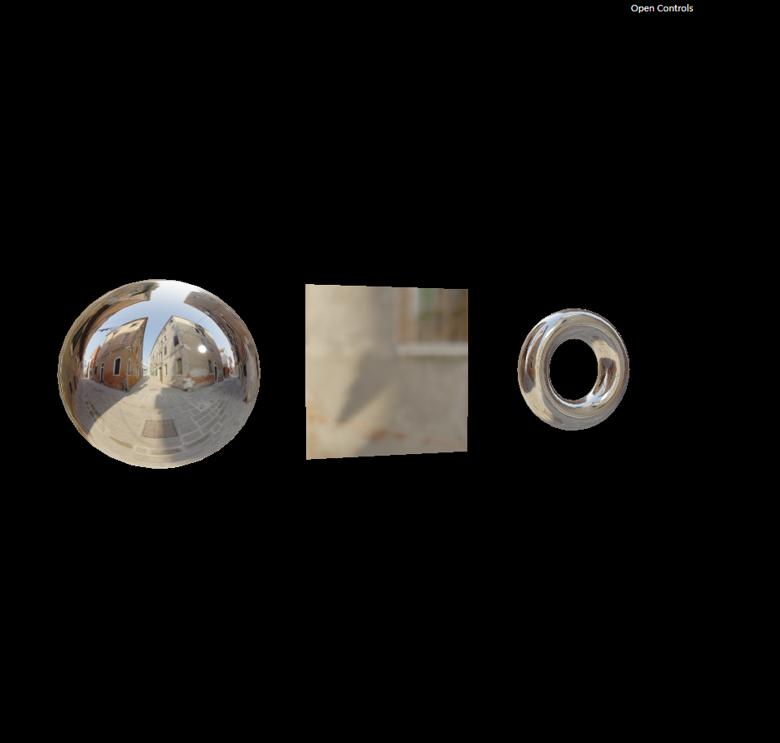
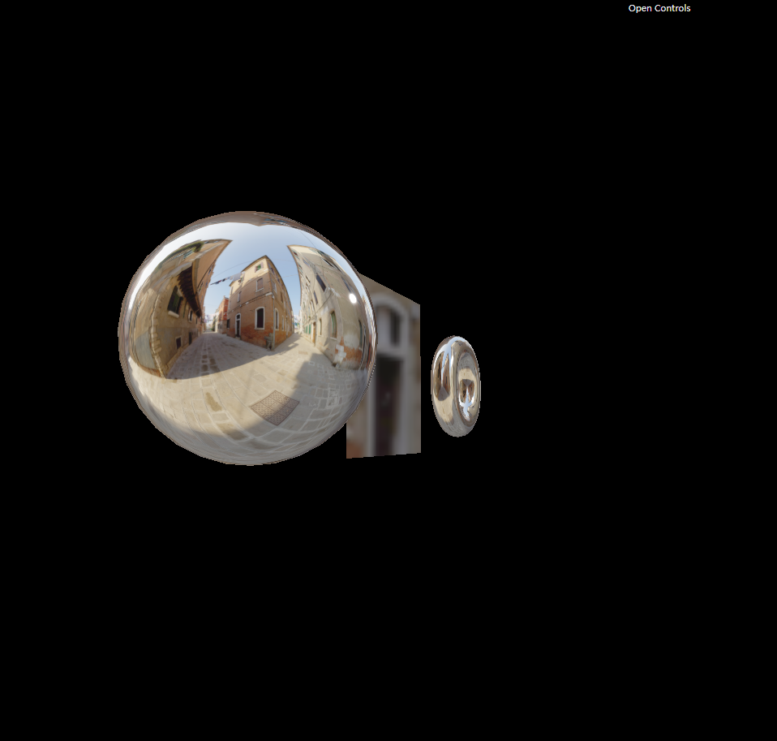

公路弯道凸面镜案例：

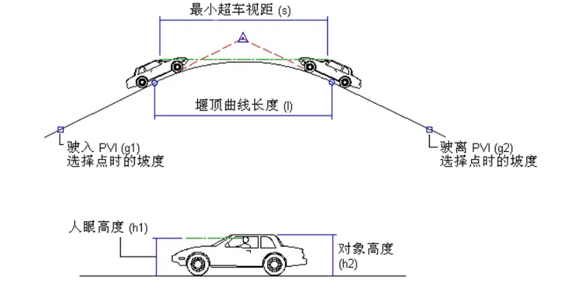

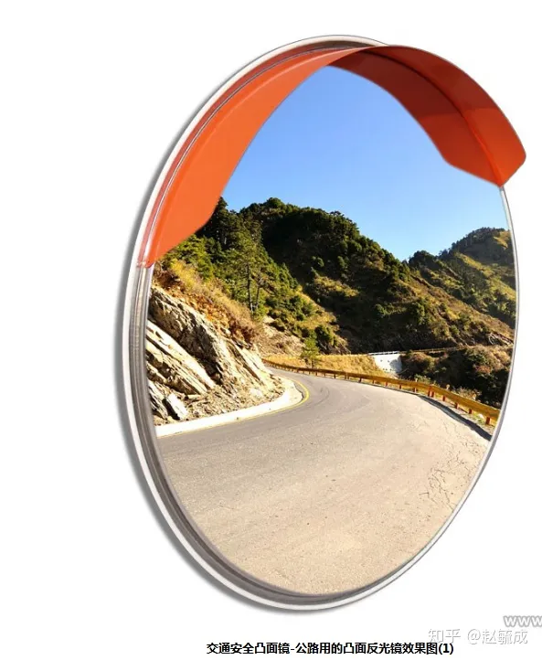
 
